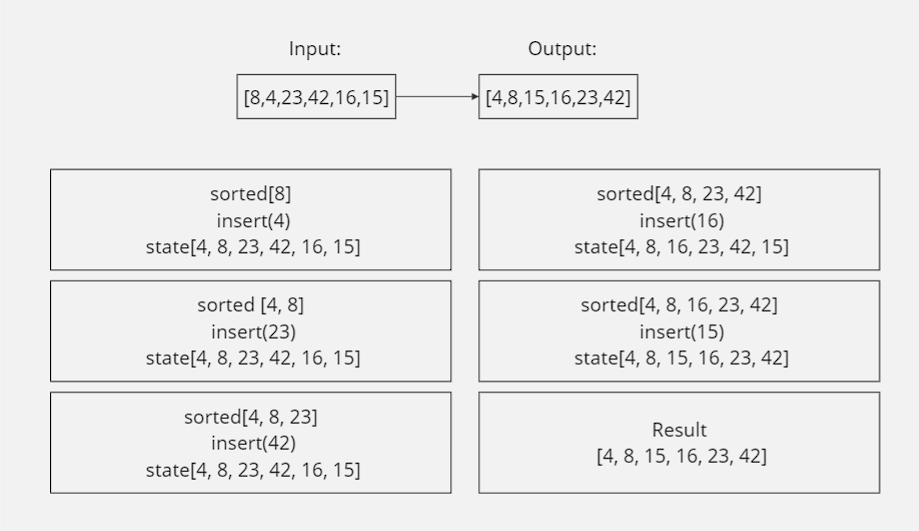
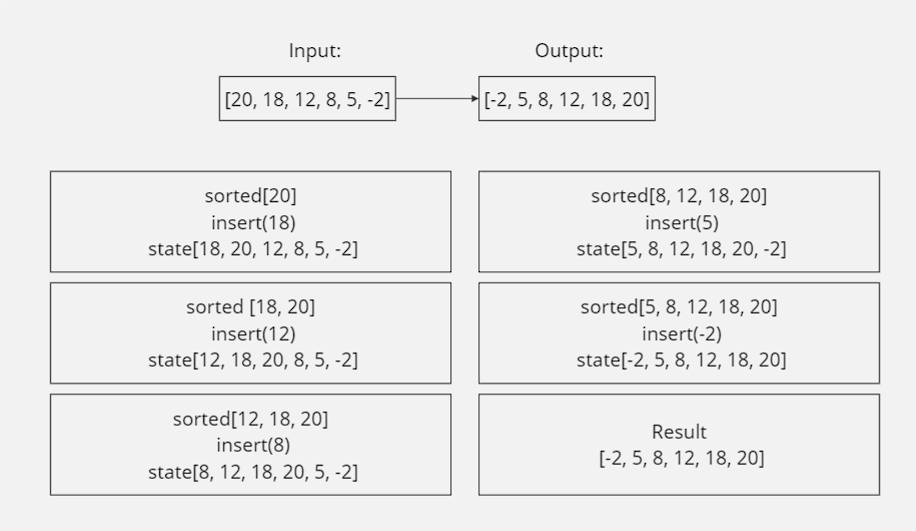
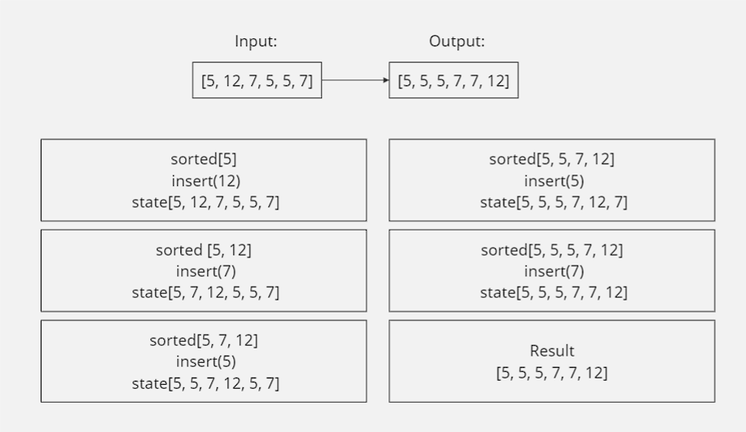
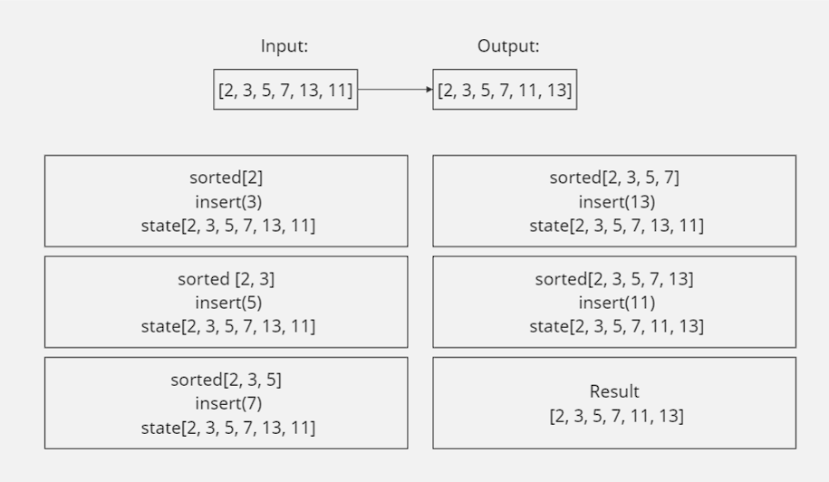

# Insertion Sort
### Author: Malik Al Hudrub
### How to initialize/run your application:
python data-structures-and-algorithms/Insertion-Sort/Insertion_sort.py

### Testing 
### How do you run tests?
+ cd data-structures-and-algorithms/Insertion-Sort/tests 
+ pytest tests.py

### Algorithm:

``` 
    def insert(sorted_arr, value):
    i = 0
    while i < len(sorted_arr) and value > sorted_arr[i]:
        i += 1
    sorted_arr.append(None)
    j = len(sorted_arr) - 1
    while j > i:
        sorted_arr[j] = sorted_arr[j - 1]
        j -= 1
    sorted_arr[i] = value

def insertion_sort(input_arr):
    sorted_arr = [input_arr[0]]  
    for i in range(1, len(input_arr)):
        insert(sorted_arr, input_arr[i])
    return sorted_arr
```
### Test cases visualization:

Case 1:

Case 2:

Case 3:

Case 4:



### Efficency:
Time: O(n^2)
+ As a nested loop is implemented

Space: O(1)
+ As it uses a constant amount of extra space