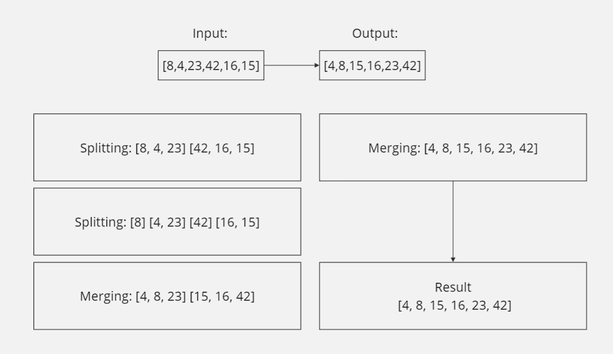
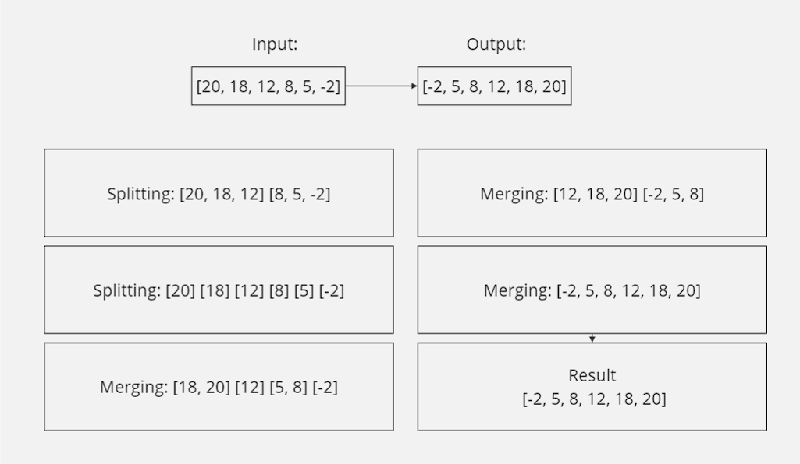
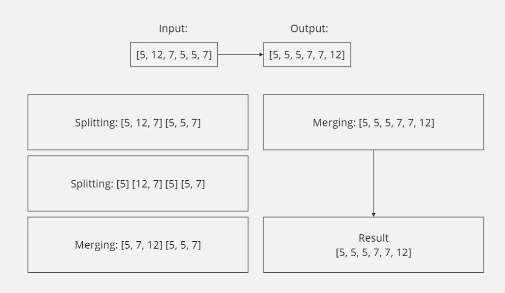
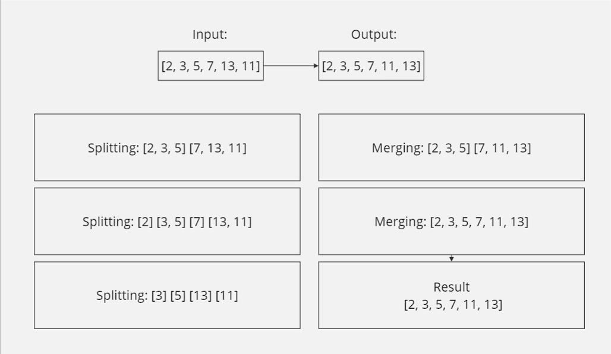

# Merge Sort
### Author: Malik Al Hudrub
### How to initialize/run your application:
python data-structures-and-algorithms/Merge-Sort/Merge_sort.py

### Testing 
### How do you run tests?
+ cd data-structures-and-algorithms/Merge-Sort/tests 
+ pytest tests.py

### Algorithm:

``` 
def merge_sort(arr):
    if len(arr) > 1:
        mid = len(arr) // 2
        left = arr[:mid]
        right = arr[mid:]
        left = merge_sort(left)
        right = merge_sort(right)
        return merge(left, right)
    return arr
def merge(left, right):
    merged = []
    i = j = 0
    while i < len(left) and j < len(right):
        if left[i] <= right[j]:
            merged.append(left[i])
            i += 1
        else:
            merged.append(right[j])
            j += 1
    merged.extend(left[i:])
    merged.extend(right[j:])
    return merged
```

### Test cases visualization:

Case 1:
------------------------


Case 2:
------------------------


Case 3:
------------------------



Case 4:
------------------------



### Efficency:
Time: O(n log n) 

Space: O(n)
