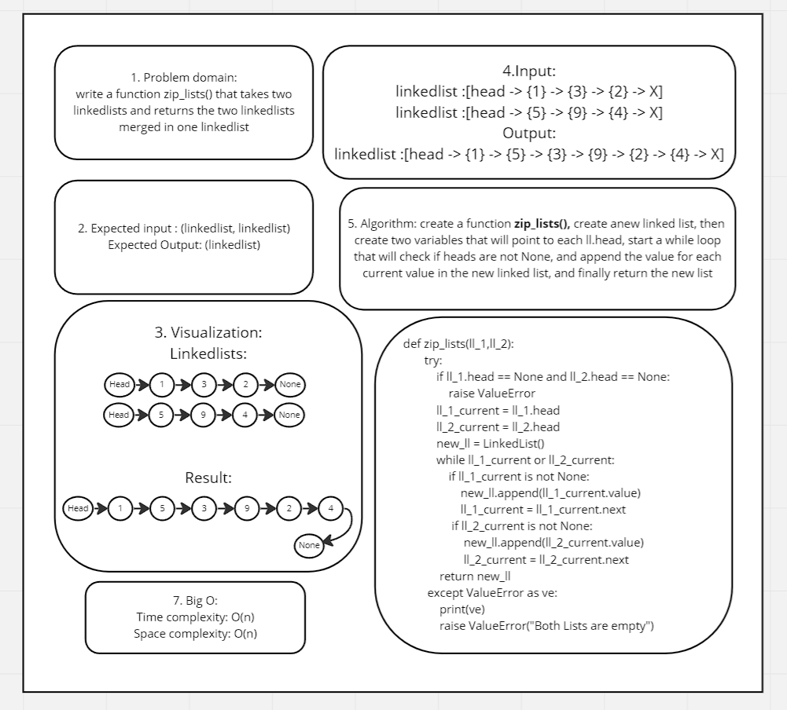

## Zip two linked lists.
### project: Zip two linked lists.
### Author: Malik Al Hudrub
## How to initialize/run your application:
### python data-structures-and-algorithms/dsa/linked_list.py
## Testing 
### How do you run tests?
#### pytest
### Test Notes:
 + test_zip_lists_both_list_empty(): raises an exception

