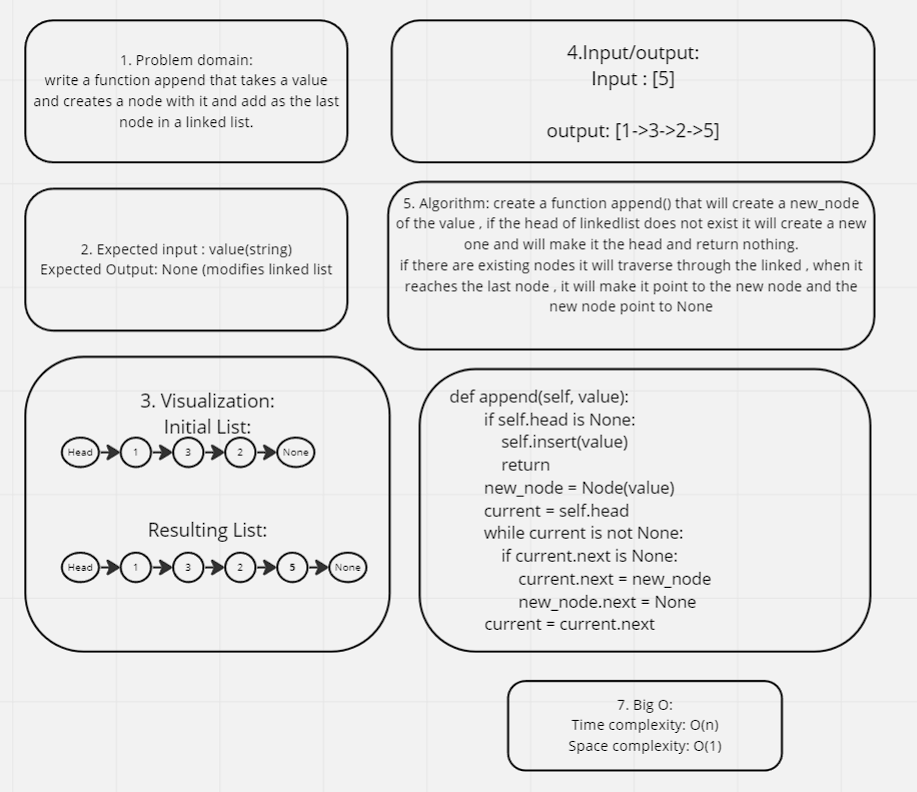
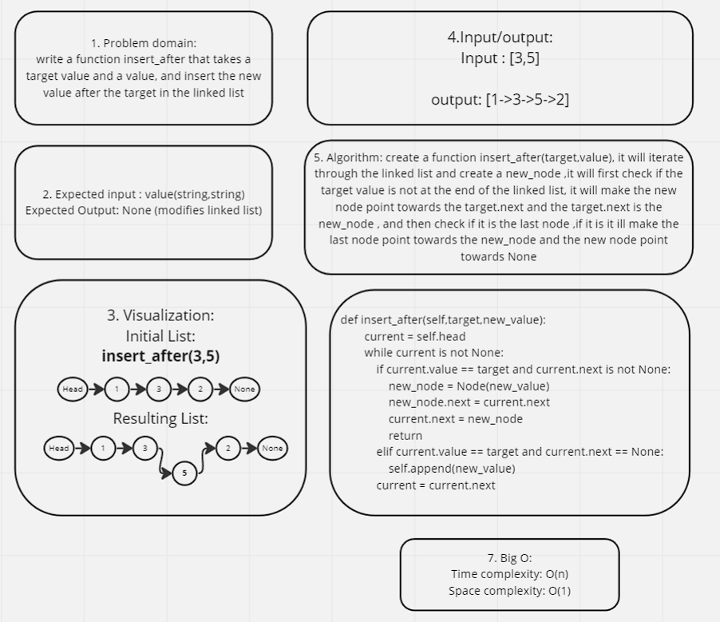

## Challenge 5 and 6
### project: Singly Linked Lists / Linkedlist Insertions
### Author: Malik Al Hudrub
## How to initialize/run your application:
### python data-structures-and-algorithms/linked_list/linked_list.py
## Testing 
### How do you run tests?
#### pytest
### Test Notes: None

## Code challenge 06 
### Append

### Insert_before

### insert_after
